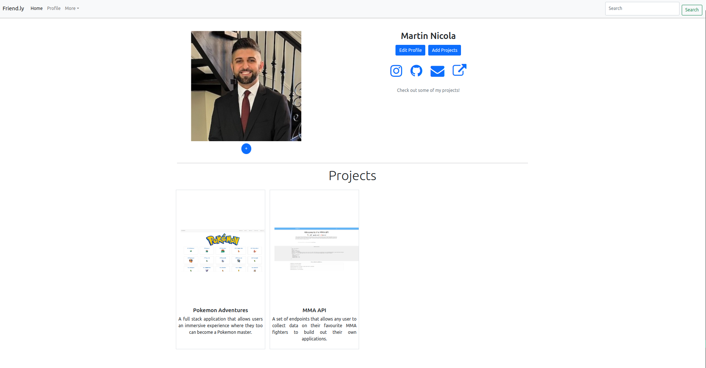
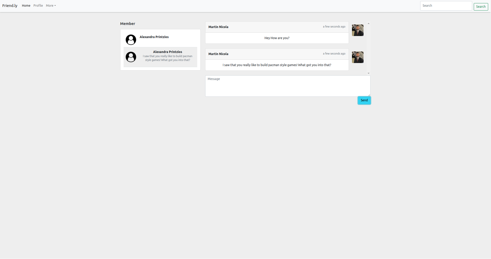

# **Connect Me**

## General Overview

Connect Me is a social media app designed for junior developers.

It allows users that are new to the tech industry to connect with each other, see each other's work and communicate in real-time.

Connect Me allows for users with very little experience to grow together in hope of finding new roles in the field of software engineering.

## Screenshots

)

## Technologies Used

- Express.js
- React.js
- Node.js
- JWT
- CSS
- Bootstrap
- SocketIO
- Vanilla JavaScript

## Complete Code

The code used in this repository is strictly for deployment and only contains the backend along with the React build folder. For the full code, go [here](https://www.github.com/codewithmarty/mern-social).

## Try it out

The app is available and ready to try [here](https://react-social-media-production.up.railway.app/)

## Future Work

- **Add Employer Accounts**: In its current implementation, every new user is a junior developer. My hope is to add an employer user that can see all available juniors to be considered for hire.
- **Add Employer Technicals**: Hope is to add the ability for an employer to post technicals so that juniors can submit their work directly. This will streamline the process of finding adequate talent for the organization. 
- **Add Job Board**: It's not a real application tailored for juniors if there isn't a job board available. The goal is for the employer to have the ability of posting brand new roles in the field that meet the criteria for entry level candidates.